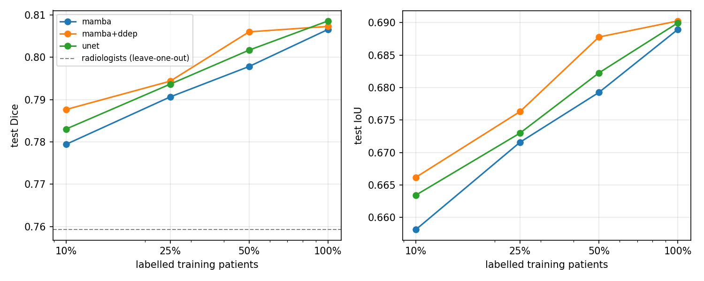
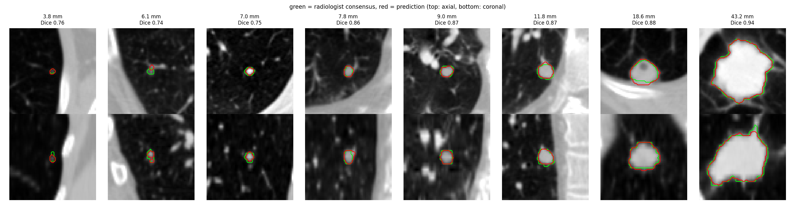
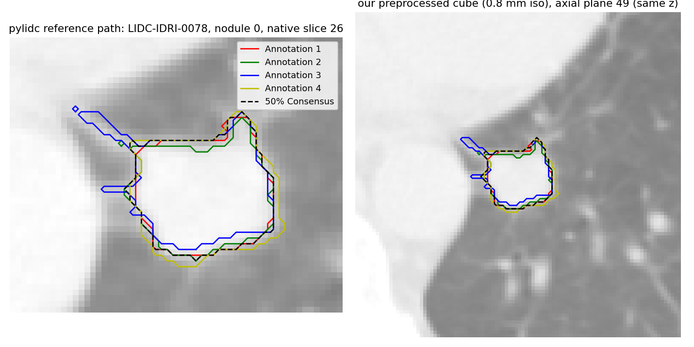
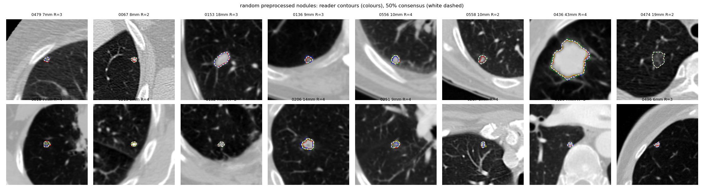

# Label-efficient lung nodule segmentation with a 3D Mamba-UNet and diffusion pretraining

3D segmentation of lung nodules on **LIDC-IDRI**, built to work well when only a
small number of scans have labels, i.e to get good results with limited data. The pieces:

* **3D Mamba-UNet.** Residual conv encoder/decoder, with tri-directional Mamba (S6
  selective state-space) layers at the 16³, 8³ and 4³ stages. The Mamba layers give
  global context in linear time. 
* **Diffusion-denoising pretraining (DDeP).** The whole network, decoder included,
  is first trained as a DDPM-style noise predictor on *unlabelled* CT cubes, then
  fine-tuned on the few labelled ones. This is where the diffusion idea of the
  original proposal is kept: it helps when labels are scarce and adds no inference cost.
* **Label-efficiency protocol.** Train on 10 / 25 / 50 / 100% of the labelled
  training *patients* (nested subsets), with equal compute per run, and test every
  model on the same held-out patients.
* **Human reference.** Every test nodule also gets a leave-one-radiologist-out
  Dice/IoU, so the model is compared against how much the four LIDC radiologists
  agree with each other.

## Results (Kaggle, 2 x T4, run of 2026-09-27)

Data: `washingtongold/lidcidri30` (TCIA LIDC-IDRI DICOM, patients 0001-0600). This
gives **1,166 nodules from 489 patients** annotated by at least 2 radiologists,
split **by patient** into 342 train / 49 val / **98 test (238 nodules)**. All
numbers below are on the same 238 held-out test nodules. Each model trained for
5,000 steps (batch 8, one seed), with flip-TTA at test time.

**Test Dice (IoU in brackets)** against the 50% radiologist consensus:

| labelled training patients | 10% (34 pts, 79 nodules) | 25% (86 pts, 215) | 50% (171 pts, 402) | 100% (342 pts, 814) |
|---|---|---|---|---|
| Residual 3D UNet | 0.783 (0.663) | 0.794 (0.673) | 0.802 (0.682) | **0.809** (0.690) |
| Mamba-UNet (scratch) | 0.779 (0.658) | 0.791 (0.672) | 0.798 (0.679) | 0.807 (0.689) |
| **Mamba-UNet + diffusion pretraining** | **0.788** (**0.666**) | **0.794** (**0.676**) | **0.806** (**0.688**) | 0.807 (**0.690**) |
| Radiologists, leave-one-out (same nodules) | 0.759 (0.629) | | | |

As of now the Iou scores are still very average in nature and need improvement which we are working on and based on my understanding its pretty proportional to the other metric which happens to be DICE.



Test Dice by nodule diameter, Mamba-UNet + diffusion pretraining at 100% labels:
<6 mm 0.727 (n=24), 6-10 mm 0.799 (n=128), 10-20 mm 0.837 (n=59), ≥20 mm 0.855 (n=27).
On nodules marked by ≥3 radiologists the Dice is 0.840 (n=169). HD95 is 1.29 mm.

What these numbers do and don't show:

* **Every model beats the radiologists' own agreement.** On the same nodules, a
  single radiologist vs the consensus of the others scores Dice 0.759. All models
  score 0.78-0.81, even with 34 labelled patients.
* **The model is data-efficient.** With 10% of the labels (79 nodules), Dice is
  only 0.02-0.03 below the 100% models.
* **Diffusion pretraining helps a little at low label counts.** It is the best
  config at 10%, 25% and 50% labels (+0.8 Dice points over Mamba-UNet from
  scratch at 10% and 50%). With 100% labels it makes no difference.
* **The Mamba layers alone do not beat a matched CNN.** Mamba-UNet from scratch
  is 0.2-0.4 points below the residual UNet. Pretraining is what closes the gap.
* **These differences are small, from a single seed and one split.** Per-nodule
  Dice has std ≈ 0.12, so gaps under ~1 point should not be read as significant
  until `--seeds 0 1 2` is run. What is solid is the absolute level (Dice ≈ 0.80,
  above inter-radiologist agreement) and how flat the curve is as labels drop.
* **IoU is ≈ 0.69, not 0.8.** For the same masks IoU is always lower than Dice.
  An IoU of 0.8 would need Dice ≈ 0.89, far above what LIDC's own radiologists
  agree on (IoU 0.63).

Test predictions (green = consensus, red = model), smallest to largest nodule:



### Preprocessing check against pylidc

Left: the official [pylidc consensus tutorial](https://pylidc.github.io/tuts/consensus.html)
figure, re-created from the raw DICOM on Kaggle (LIDC-IDRI-0078, nodule 0,
4 readers + 50% consensus). Right: our resampled 0.8 mm cube of the same nodule
at the same z. It is the same juxta-pleural nodule with the same reader contours
(including reader 3's spur towards the pleura) as the figure on the pylidc site.



On 60 random nodules, our consensus volume divided by pylidc's native-resolution
consensus volume is median **0.977** (5th-95th percentile 0.87-1.04). Mean HU
inside the mask is 28 HU lower, the expected partial-volume effect of resampling
3 mm slices. A random sample of preprocessed crops with every reader's contour:



## Data protocol

* Source: all 1,018 LIDC-IDRI CT scans with pylidc's annotation database. Nodules
  are ≥3 mm by LIDC definition, and only nodules marked by **≥2 radiologists** are
  kept: 1,880 nodules from 796 patients.
* Each nodule is stored as a 96³ cube at 0.8 mm isotropic spacing, centred on the
  50% consensus. Each reader's own mask is kept too. Training samples random 64³
  views (rotation, tilt, 0.8–1.25 scale, flips, ±6 mm off-centre, intensity,
  blur, and thick-slice simulation), all done on the GPU.
* Splits are by **patient**: 70% train, 10% val, 20% test, seed 0. Label fractions
  subsample the *training* patients only, and the subsets are nested
  (10% ⊂ 25% ⊂ 50% ⊂ 100%).
* Pretraining uses images only: all training patients plus random lung cubes from
  patients without qualifying nodules. **Val/test patients are never used.**
* **Preprocessing QA** (`python -m lungseg.qa`). It re-creates the official
  [pylidc consensus tutorial](https://pylidc.github.io/tuts/consensus.html) figure
  (LIDC-IDRI-0078, 4 readers + 50% consensus) from the raw DICOM, puts our
  resampled cube of the same nodule next to it, and writes a grid of random
  crops. For random nodules it also checks the consensus volume and mean HU
  against pylidc's native-resolution volume. The consensus volume should match
  to within a few percent. The mean HU inside the mask comes out a little lower
  because of partial-volume smoothing at the boundary.
* Task definition: segmentation of a *given* nodule (the crop centre is known).
  This is the standard LIDC segmentation benchmark setting. It is not detection.

## Quick start (Kaggle, free GPU)

Open `notebooks/kaggle_lidc_mamba.ipynb` on Kaggle. Turn on GPU and internet, add
the dataset `washingtongold/lidcidri30` (original TCIA DICOM folders for about a third of
LIDC-IDRI, 41 GB), and *Run all*. `justinkirby/the-cancer-imaging-archive-lidcidri`
contains only the XML annotations, no images. By hand:

```bash
pip install -r requirements.txt
# optional, faster Mamba kernels on NVIDIA GPUs
pip install causal-conv1d mamba-ssm --no-build-isolation

python -m pytest -q tests                                       # sanity checks
python -m lungseg.data.prepare_lidc --dicom_root /path/to/LIDC-IDRI --out data/lidc_crops
python -m lungseg.experiments --data data/lidc_crops --runs runs  # whole study, resumable
python -m lungseg.evaluate  --data data/lidc_crops --ckpt runs/mamba_ddep_f1_s0/best.pt
python -m lungseg.visualize --data data/lidc_crops --ckpt runs/mamba_ddep_f1_s0/best.pt
```

Single runs:

```bash
python -m lungseg.pretrain --data data/lidc_crops --out runs/pretrain_mamba --arch mamba
python -m lungseg.train    --data data/lidc_crops --out runs/my_run --arch mamba --fraction 0.1 \
                           --init runs/pretrain_mamba/pretrain.pt
```

CPU-only smoke test with synthetic data (no LIDC dataset needed):

```bash
python -m lungseg.data.synthetic --out data/synthetic --n_patients 30
python -m lungseg.train --data data/synthetic --out runs/syn --steps 300 --crop 48 --widths 16 32 64 64 96
```

## Repository layout overview

```
lungseg/
  compat.py               numpy/pkg_resources shims so pylidc works on modern numpy
  data/prepare_lidc.py    DICOM + pylidc -> nodule cubes, reader masks, patient splits
  data/dicom_io.py        series index + lazy per-slice decoding (reads only the slices it needs)
  data/dataset.py         in-RAM crop sets, nested label fractions, GPU augmentation
  data/download_tcia.py   optional downloader for the TCIA public API
  data/synthetic.py       synthetic cache with the same format, for tests
  models/ssm.py           Mamba/S6: mamba_ssm CUDA | PyTorch parallel scan | reference scan
  models/mamba_unet.py    3D Mamba-UNet and the matched residual-UNet baseline
  pretrain.py             diffusion-denoising pretraining
  train.py                supervised fine-tuning (Dice+BCE, deep supervision, EMA, AMP)
  evaluate.py             per-nodule Dice/IoU/precision/recall/HD95 + radiologist agreement
  experiments.py          label-efficiency grid + summary table and plot
  visualize.py            qualitative figure
notebooks/kaggle_lidc_mamba.ipynb
tests/                    scan maths, causality, model shapes, metrics, preprocessing alignment
docs/original_proposal.pdf
```

## Why these design choices (limited labels)

* **Conv stages at high resolution, Mamba at low resolution.** Conv layers are
  sample-efficient for edges and texture. Global mixing matters at coarse scales
  (telling a nodule from a vessel it touches, or from the pleura). A pure
  patch-16 ViM, as in the first version, loses the 3–10 mm nodules entirely.
* **Denoising pretraining over contrastive or MAE pretraining.** It trains
  encoder *and* decoder on unlabelled data, and the decoder is most of a
  segmentation network. It is also the part of the original diffusion idea that
  pays off for segmentation.
* **Nodule-centred 3D crops, isotropic resampling.** These remove the class
  imbalance and the slice-thickness variation (0.6–3 mm) that dominate
  full-volume training on small data.
* **EMA weights, heavy augmentation done on the GPU, fixed step budget,
  consensus-of-readers targets.** Standard ways to keep variance low when there
  are only ~100 labelled nodules.
* **A matched baseline.** `--arch unet` swaps every Mamba layer for a residual
  conv block. If the Mamba layers don't help, the table will show it.

## What changed from the first version

The first version could not produce a meaningful result:

* the dataset returned all-zero masks;
* when `mamba-ssm` was missing, the "Mamba" layer silently became a single `nn.Linear`;
* the demo painted a synthetic nodule onto the CT and trained on that single image;
* the committed `.pth` had been trained on those empty masks.

All of that has been replaced. The proposal PDF is kept in `docs/`.

## Limitations

* One patient-level split. Use `--seeds 0 1 2` in `experiments.py` for variance
  over training seeds; cross-validation is not implemented.
* The nodule position is assumed known (a crop around it). A detector
  would be needed for a fully automatic pipeline.
* LIDC masks carry real inter-reader variability. Scores well above the
  radiologist leave-one-out agreement should be viewed with suspicion.

Authors of the original proposal: Uday Yerraballi, Chris Jason Baskar.
